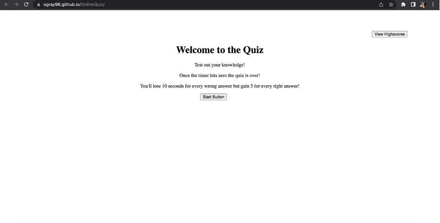

ONLINE QUIZ

Week 4 Challenge: Creating a Quiz

Live link: https://ogray96.github.io/OnlineQuiz/

This week for the weekly challenge the task was to create a quiz that a user would be able to play. The quiz was to have a timer and move to the next question once a question was answered. Furthermore if an answer was incorrect the player had time subtracted from their timer. Once the quiz was finished or the timer reached zero the player could save their score onto the scoreboard. This scoreboard is saved in local storage so wouldn't dissapear when the user refreshes the page.

